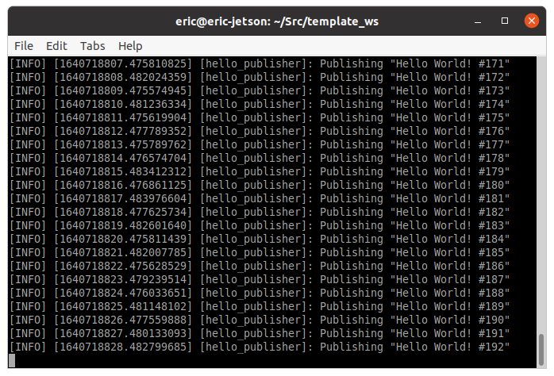

# Turn On the PiOLED

The PiOLED from the bill of materials of the JetBos.org is an [Adafruit 128x32 PiOLED](https://www.adafruit.com/product/3527)

Fortunately Adafruit provides a set of Python libraries - called __CircuitPython__ - and very good news there is a special version of the CircuitPython for Jetson Nano, called __Blinka__

> [CircuitPython Libraries on Linux and the NVIDIA Jetson Nano](https://learn.adafruit.com/circuitpython-libraries-on-linux-and-the-nvidia-jetson-nano/circuitpython-dragonboard)

Now that we've found the base libraries, what do we need to turn on that PiOLED ?
Let's have a look at [Adafruit PiOLED - 128x32 Mini OLED for Raspberry Pi](https://learn.adafruit.com/adafruit-pioled-128x32-mini-oled-for-raspberry-pi?view=all) in the Adafruit learning center.

> We need to use the Python library for the SSD1306 chipset

## Install the Python libraries

``` bash
# AdaFruit Blinka, the lib to use AdaFruit CircuitPython on a Jetson nano
sudo pip3 install adafruit-blinka

# PiOLED (with SSD1306 chipset)
sudo pip3 install adafruit-circuitpython-ssd1306
```

> BTW, the Adfruit libraries used in the JetBot ROS project proposed by NVidia are deprecated
>
> i.e. [Adafruit Python Library for DC + Stepper Motor HAT](https://github.com/adafruit/Adafruit-Motor-HAT-Python-Library)
>
> So it's a good idea refreshing the Jetbot project

## A first ROS Node

The [pioled_node.py](../jetbot_motors/jetbot_motors/pioled_node.py) is a subscriber node that subscribes to a topic where string messages are published.

You can use any publisher node like the one explained in the [ROS2 Tutorial](https://docs.ros.org/en/galactic/Tutorials/Writing-A-Simple-Py-Publisher-And-Subscriber.html) or in our [ROS2 Hello World Template](https://github.com/z-Index-ros/ros_template_hello)

### Compile, source and run the publisher

Following the __ROS2 Tutorial__ or the __OS2 Hello World Template__ you should have a publisher node ready to run, i.e. :

``` bash
ros2 run hello_py_pkg publisher
``` 


### Compile, source and run the pioled node

Open a terminal window in the ~/jetbot_ws folder and source ROS2, then:
``` bash
# build
colcon build

# and source
. install/local_setup.bash

# Start the publisher ROS Node and the Pioled
ros2 run jetbot_motors pioled
``` 
### The publisher node output


### The pioled node output an dthe pioled display


