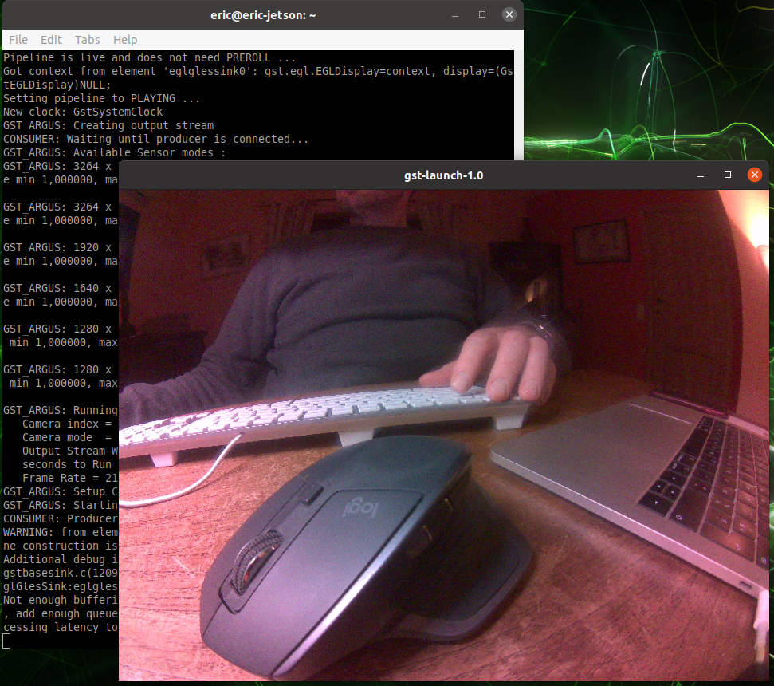

# Turn on the camera

The OpenCV library is used to manage the camera and image streams.

The first step - if you don't have already OpenCV installed - is ... installing it.

> There is an excellent tutorial provided by Q-engineering team [read more](https://qengineering.eu/install-opencv-4.5-on-jetson-nano.html), it is the same team we used for the Ubuntu installation described in the [home page](README.MD#installing-ubuntu-2004)

## Sources that can be helpful

For a better overview and understanding of using vision perception with ROS, here are some interresting articles and/or github projects.

* [CSI-Camera](https://github.com/JetsonHacksNano/CSI-Camera): Simple example of using a MIPI-CSI(2) Camera (like the Raspberry Pi Version 2 camera) with the NVIDIA Jetson Nano Developer Kit
* [opencv_cam](https://github.com/clydemcqueen/opencv_cam): A simple ROS2 camera driver based on OpenCV (but for ROS2 Eloquent or Foxy only)
* [ros2_numpy](https://github.com/Box-Robotics/ros2_numpy/): This project is a fork of ros_numpy to work with ROS 2. It provides tools for converting ROS messages to and from numpy arrays.
* [Getting Started With OpenCV in ROS 2 Galactic (Python)](https://automaticaddison.com/getting-started-with-opencv-in-ros-2-galactic-python/): excellent tutorial to learn the basics of how to interface ROS 2 Galactic with OpenCV
* [cv_bridge](https://github.com/ros-perception/vision_opencv/tree/ros2/cv_bridge): cv_bridge converts between ROS2 image messages and OpenCV image representation for perception applications. Supports differents ROS distros by mean of differente branches.
* [GStreamer gst-launch](https://gstreamer.freedesktop.org/documentation/tools/gst-launch.html?gi-language=c): a tool that builds and runs basic GStreamer pipelines

## Test you camera

### Using GStreamer

``` bash
# camera connected on slot 0
gst-launch-1.0 nvarguscamerasrc sensor_id=0 ! 'video/x-raw(memory:NVMM),width=3264, height=2464, framerate=21/1, format=NV12' ! nvvidconv flip-method=0 ! 'video/x-raw, width=816, height=616' ! nvvidconv ! nvegltransform ! nveglglessink -e
```


### Using OpenCV and Python

The python file [](../jetbot/jetbot/test-cv2.py) is a small code that will open a window and show the image form the camera.

``` bash
python test-cv2.py
```

> Same output as with GStreamer

> Sometime the service nvargus-daemon is stucked, her's how to restart
>
> ``` sudo service nvargus-daemon restart ```


